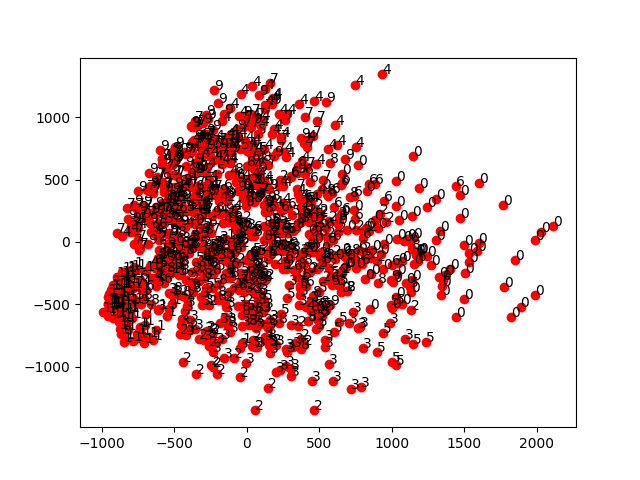
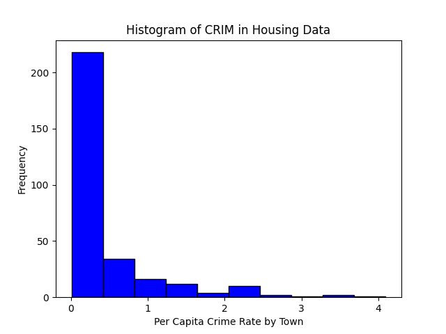

## Used libraries and their purposes
```
import pandas as pd
import matplotlib.pyplot as plt
from sklearn.decomposition import PCA
```

The pandas library allows for data manipulation and analysis. I use it to read in my csv files, but it has many more applications.

The matplotlib allows me to create plots and charts for data visualization.

The sklearn library is a machine learning library that allows us to perform Principal Component Analysis (PCA) on our MNIST dataset. PCA is used to reduce the numbers in the dataset while preserving the variance. We fit the PCA model to the training data using the fit() function. This calculates the principal components based on the variance in the data. After fitting, transform() projects new data onto the principal components. The number of components to keep using is the n_components param. Alternatively, you can set it to a float between 0 and 1 to retain a certain percentage of the variance.

### MNIST PCA Visualization
Above, we visualize the large MNIST dataset summarily in Principal Components. The values 0-9 are visualized taking into account the most variability in the data. 


## Boston Housing Dataset (PTRATIO, LSTAT and MEDV)
Above looks at columns 11, 13 and 14- PTRATIO, LSTAT and MEDV respectively. PTRATIO is the pupil-teacher ratio by town, LSTAT is the percent of lower status of the population, and MEDV is the median value of owner-occupied homes in $1000’s. To help visualize, the color of each boxplot has been altered and the x-axis labeled. Outliers are visualized in circles above the boxplot max and min quartiles.


## Boston Housing Dataset (CRIM)
Above is a histogram featuring the CRIM- per capita crime rate by town. A per capita crime rate is the number of crimes per 100,000 people in a town. The incidence of crime goes above 4, with the highest frequency being less than 1 crime per 100,000 people. 
